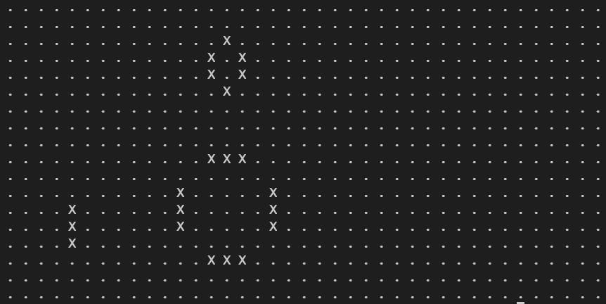

# Game of Life

> This is a personal project that I created to get some hands in C language.

---

## Description

In this project I used C to build the Conway's Game of Life. 
The project contains two modules:
 - life: contains the game of life logic
 - animations: contains an app to run the game of life in the console.

---

## About Conway's Game of Life

The Game of Life, also known simply as Life, is a cellular automaton devised by the British mathematician John Horton Conway in 1970. It is a zero-player game, meaning that its evolution is determined by its initial state, requiring no further input. One interacts with the Game of Life by creating an initial configuration and observing how it evolves. It is Turing complete and can simulate a universal constructor or any other Turing machine.

You can check mor information about game of life [here](https://en.wikipedia.org/wiki/Conway%27s_Game_of_Life).

---

## Author Info

- LinkedIn - [André Jesus](https://www.linkedin.com/in/andre-jesus-engineering)
- Twitter - [@andre_j3sus](https://twitter.com/andre_j3sus)
- Website - [André Jesus](https://sites.google.com/view/andre-jesus/p%C3%A1gina-inicial)
